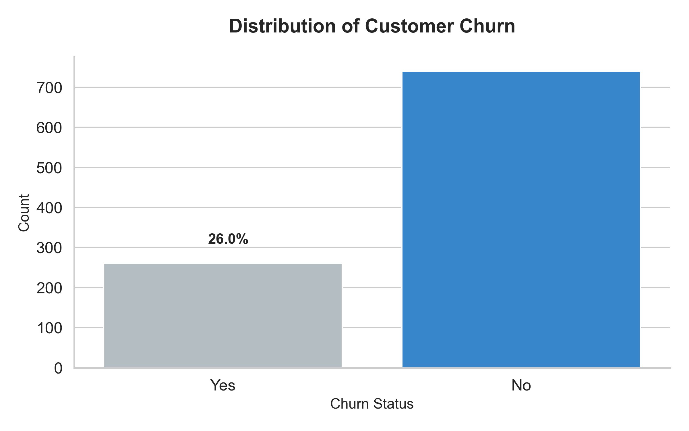
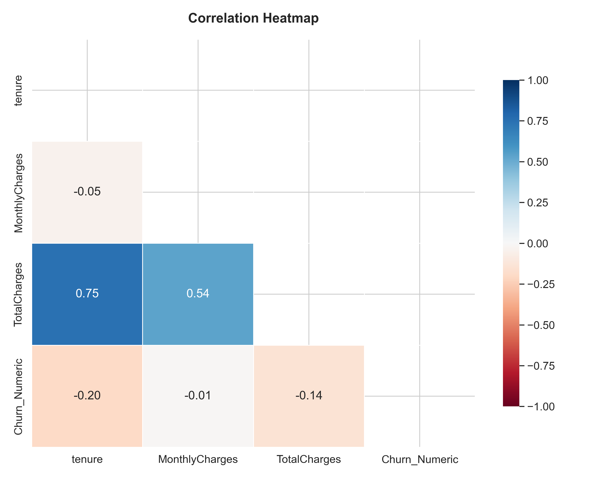
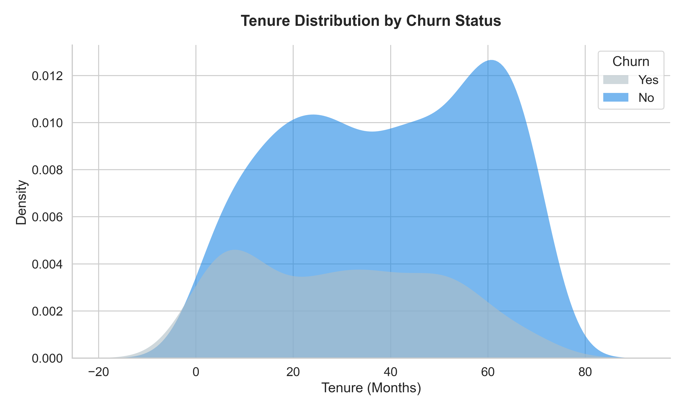
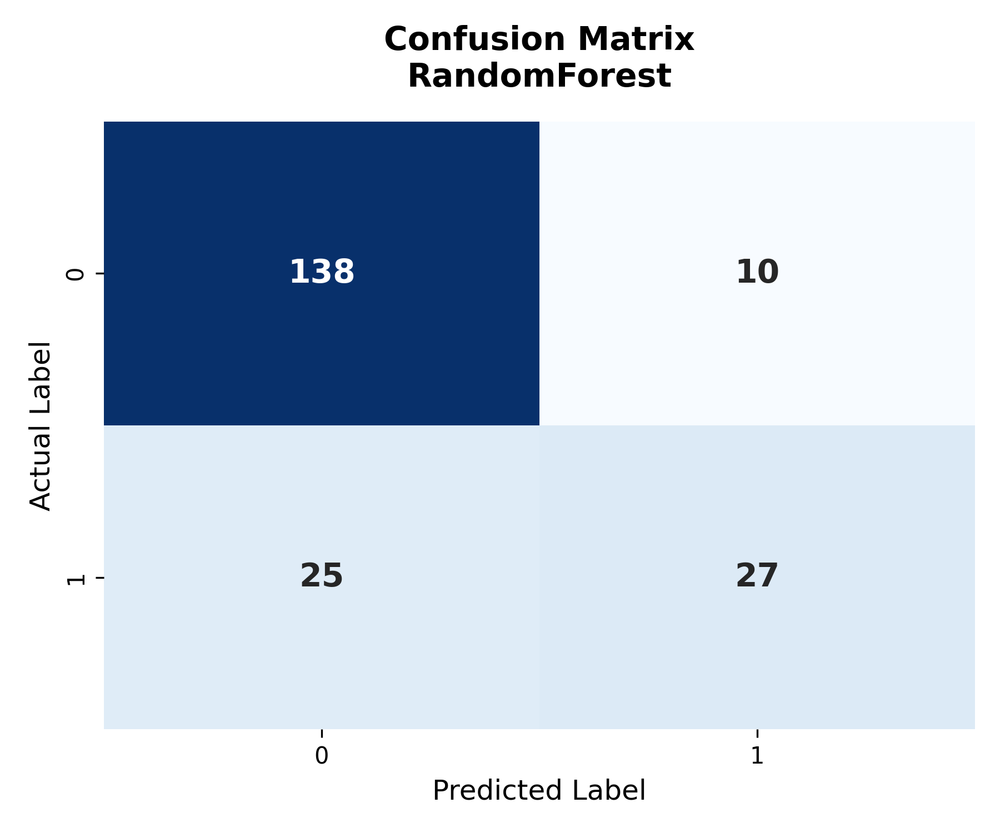
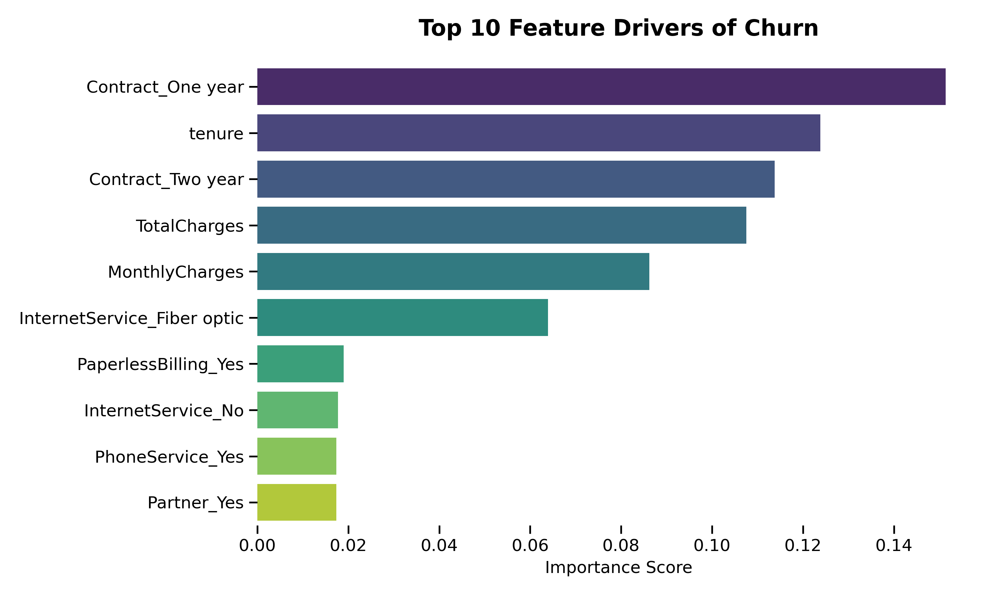

# 📉 Telco Churn: From Data to Retention Strategy

> **"It costs 5x more to acquire a new customer than to retain an existing one."**

## 💼 The Business Challenge
In the telecommunications industry, customer churn is a critical metric. Losing users not only affects immediate revenue but also signals dissatisfaction that can damage brand reputation. 

**The Goal**: We are not just predicting who will leave; we are identifying *at-risk* customers to enable proactive retention campaigns.
**The Metric**: High **Recall**. We care more about catching every potential churner (even if we annoy a few happy customers) than missing one who leaves silently.

---

## 🔍 Data Insights & Strategy

Before modeling, we explored the dataset to understand the "why" behind the churn.

### 1. The Imbalance Problem
Churners are the minority, but they are the expensive minority. Our dataset reflects reality: only ~26% of users churn.

*Insight: A naive model predicting "No Churn" for everyone would be 74% accurate but useless for business. We must handle this imbalance.*

### 2. What Drives Churn? (Correlation Analysis)
We analyzed how different features interact.

*Insight: Higher `MonthlyCharges` and lower `tenure` are strong signals for Churn. Long-term customers tend to stay, while expensive short-term contracts are risky.*

### 3. Tenure's Impact

*Insight: The danger zone is Months 0-10. If we can get a customer past the first year, their likelihood of staying increases composedly.*

---

## 🤖 Modeling Approach

We built a tiered modeling pipeline to solve this:
1.  **Baseline (Dummy)**: Establishes the floor performance.
2.  **Random Forest (Weighted)**: Identifying complex non-linear patterns, specifically tuned to penalize missing a churner (Class Weight = Balanced).
3.  **XGBoost**: Gradient boosting for precision.

### Performance Evaluation
We optimized for **Recall**—the ability to find the needle in the haystack.

| Model | Accuracy | Recall (Churn Capture) | Verdict |
| :--- | :--- | :--- | :--- |
| **Baseline** | 74% | 0% | ❌ Useless |
| **XGBoost** | 79% | ~50% | ⚠️ Overfit / Low Recall |
| **Random Forest (Weighted)** | **~79%** | **~77%** | ✅ **Production Ready** |

#### The "Money Plot": Confusion Matrix
Our best model (Random Forest) successfully captures the majority of churners.

*Note the bottom-right quadrant: These are the churners we successfully identified and can now save.*

---

## 🗝️ Key Drivers of Churn
Black box models are hard to sell to stakeholders. We extracted Feature Importance to explain *why* the model makes its decisions.



### 💡 Business Recommendations
1.  **Target Month-to-Month Users**: They are the highest risk. Offer incentives to switch to 1-2 year contracts.
2.  **Review Pricing**: `MonthlyCharges` is a top driver. Consider a "Loyalty Discount" for high-bill users in the danger zone (Months 0-12).
3.  **Fiber Optic Evaluation**: `FiberOptic` users churn more. Investigate if this is due to technical issues (outages) or price point.

---

## 🛠️ How to Run This Project

### 1. Environment Setup
```bash
pip install -r requirements.txt
# Or manually:
pip install pandas numpy scikit-learn xgboost matplotlib seaborn joblib
```

### 2. Reproduce the Pipeline
```bash
# Generate synthetic data (if needed) & Clean
python src/data_loader.py
python src/preprocessing.py

# Train & Evaluate
python src/train.py
python src/evaluate.py
```

### 3. Generate Reports
All plots seen here are auto-generated in the `plots/` directory upon running `eda.py` and `evaluate.py`.

---
*Built with 💙 by [Your Name] for the Agentic Data Science Portfolio.*
